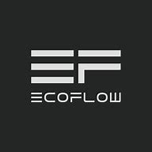

# ioBroker.ecoflow_catshape

## EcoFlow adapter for ioBroker

ioBroker adapter based on the official EcoFlow HTTP-API (https://developer-eu.ecoflow.com). 

Provides communication with products from EcoFlow (https://www.ecoflow.com) within the ioBroker software (https://www.iobroker.net).

## WARNING

This adapter uses the official EcoFlow HTTP-API (https://developer-eu.ecoflow.com) and therefore depends on the maintenance of that API by EcoFlow.

Use at own risk.

The adapter is based on:
* https://developer-eu.ecoflow.com/us/document/introduction

## How to use

### 1. Install the adapter in ioBroker and create an instance

### 2. Fill the configuration of the instance

### 3. Start/run the instance
For each of the devices in the configuration the following ioBroker objects are automatically created: 
<br/>Object of type device with 4 states: "name", "productName", "online", "quota"

### 4. Create ioBroker states
Only the 4 basic states "name", "productName", "online" and "quota" are automatically created by the adapter.
<br/>It is up to you to create more states within the devices.
<br/>In the state "quota" you see the complete data-set provided by the EcoFlow API for your device. It comes as a JSON string.
<br/>You want to use some (or all) of theese property-value pairs as states.
<br/>Please check out the files in <b>https://github.com/CatShape/ioBroker.ecoflow_catshape/tree/main/doc</b> 
to understand how to set up your states. There you find many examples for different EcoFlow products. 
<br/>The mapping between the ioBroker state and the "quota" properties is done in the "native" section of the state-definition.
<br/>For more information please read the section [How to set up the device states](#How-to-set-up-the-device-states).

As soon as you add a new read-only state, the adapter will start updating its value. No instance restart is needed.
<br/>If you add a new read-write state, you have to restart the instance in order for the adapter to register value-changes of the new state!

### 5. Export/save the ecoflow_catshape object-tree to a JSON-file.
I strongly recommend that you export/save the complete ecoflow_catshape object-tree to a JSON-file. Use the "Save objects tree as JSON file" action in ioBroker. 
<br/>Whenever you change or add any states, don't do it in ioBroker directly, but rather do it in your file and then use the "add objects tree from JSON file" action in ioBroker.
<br/>This way you have your states always up to date saved in a file and you can easily recreate them in ioBroker if needed.
<br/>Keep in mind: If you delete an adapter-instance or the adapter itself, all the states in that instance are also deleted!

## Configuration

### node-cron schedule for getting data from EcoFlow
Examples: ``` 5 * * * * * ``` (once per minute), ``` */10 * * * * * ``` (every 10 seconds). 
<br/>For more information please visit: https://github.com/node-cron/node-cron/blob/master/README.md
    
### Reset time for cumulate daily states (state is set to 0 at this time)
This adapter offers the possibility for any state with numeric value to have its value cumulated over the course of a day into another state.
A typical example would be the output power in Watts of a power source and you want to know the total energy (Watt-hours) that has been put out since the begin of day.
The exact details of how to set that up can be found in the section [Daily cumulate state values](#Daily-cumulate-state-values).

Examples: ``` {"hour": 0} ``` (midnight), ``` {"hour": 3, "minute": 30} ```, ``` {"hour": 1, "minute": 55, "second": 5} ```

### EcoFlow API keys
In order to use this adapter you need a valid EcoFlow API key. You can request a key on: https://developer-eu.ecoflow.com or https://developer.ecoflow.com.

### EcoFlow Devices
Here you provide the serial numbers of the devices you want to be included in the adapter. 

For each device you can choose whether or not to request and update the device data if the device is offline. 
It is recommended to check this box, because the data does not change anyway while the device is offline. 

The device data delivered by the EcoFlow API, comes as one JSON-string containing all data (key-value pairs). It is called "quota". 
<br/>You can select to have this quota saved to the state "quota" every time the data is delivered. 
<br/>If you do not check this box, you can still force the adapter to fill this quota-state, by clearing the value of this state (set the value to empty-string). 
<br/>The adapter always checks whether this state is empty, and if so, it will be filled.
<br/>The idea behind this state is purely informative. It gives you the possibility to check out the complete data-set delivered by the API. 

## How the adapter works

### Every time the node-cron schedule provided in the configuration is triggered, the following 3 steps are executed.

<b>1. For each of the devices in the configuration: </b>

Create (if they do not exist already) the device-object with states "name", "online", "productName" and "quota".

<b>2. For each API key: </b>

Request all devices from the EcoFlow API. Response example: 
``` 
[
    {"sn":"DCEBZXXXXXXXXXX","deviceName":"Delta Pro test","online":1,"productName":"DELTA Pro"},
    {"sn":"HW51ZXXXXXXXXXX","deviceName":"PowerStream test","online":1,"productName":"PowerStream"},
    {"sn":"P2EBZXXXXXXXXXX","deviceName":"River Pro test","online":0,"productName":"RIVER Pro"}
] 
```

<b>3. For each of theese devices (if included in the configuration): </b>

Request device-data from the EcoFlow API. Response example (quota): 
``` {"20_1.pv2Temp":190,"20_1.invOutputWatts":0,"20_1.pv2RelayStatus":0,"20_1.mqttTlsLastErr":0,"20_1.batInputVolt":493,"20_1.invDemandWatts":200,"20_1.wifiEncryptMode":3,"20_1.pv2OpVolt":0, ...} ```

Loop over all states of the device: Get and set the corresponding value from the above response. 

### Every time the value of a read-write state is changed with ack=false:

Create a request to the EcoFlow API that sends the new value to the EcoFLow cloud (and from there hopefully to the physical device).

### How to set up the device states

In order to provide as much flexibility as possible, you can create the states for each device by yourself. 
<br/>The adapter itself creates only the device-object and the 4 states "deviceName", "productName", "online" and "quota" as mentioned before. 
<br/>This gives you a lot of freedom in how to structure and name your states. 
<br/>Typically you are not interested in all of the data delivered by the API. I recommend to only create the states you really need. 
<br/>You can always add more states later on, whenever you need them. 

The mapping between a state and the JSON-data delivered by the API is done in the native property of the state. Here is how it works:

Lets say you want a state for the read-only property "20_1.pv2Temp". This is how the state definition would look like. Example 1:
``` 
  "ecoflow_catshape.0.HW51ZXXXXXXXXXX.heartbeat.pv2Temp": {
    "type": "state",
    "common": {
      "type": "number",
      "unit": "°C",
      "name": "PV2 temperature",
      "read": true,
      "write": false,
      "def": 20
    },
    "native": {
      "ecoflowApi": {
        "quotaValueKey": "20_1.pv2Temp",
        "valueFactor": 0.1
      }
    },
    "_id": "ecoflow_catshape.0.HW51ZXXXXXXXXXX.heartbeat.pv2Temp",
    "acl": {
      "object": 1636,
      "state": 1636,
      "owner": "system.user.admin",
      "ownerGroup": "system.group.administrator"
    }
  } 
```

Example 2:

``` 
  "ecoflow_catshape.0.HW51ZXXXXXXXXXX.general.batteryPackType": {
    "type": "state",
    "common": {
      "type": "number",
      "name": "Battery pack type",
      "read": true,
      "write": false,
      "states": {
        "0": "No battery",
        "1": "Secondary pack",
        "2": "Primary pack",
        "3": "Primary pack"
      }
    },
    "native": {
      "ecoflowApi": {
        "quotaValueKey": "20_1.bpType"
      }
    },
    "_id": "ecoflow_catshape.0.HW51ZXXXXXXXXXX.general.batteryPackType",
    "acl": {
      "object": 1636,
      "state": 1636,
      "owner": "system.user.admin",
      "ownerGroup": "system.group.administrator"
    }
  }
```

Example 3:

``` 
  "ecoflow_catshape.0.HW51ZXXXXXXXXXX.general.prioritizeBatterySupply": {
    "type": "state",
    "common": {
      "type": "boolean",
      "name": "Prioritize power to battery",
      "read": true,
      "write": true
    },
    "native": {
      "ecoflowApi": {
        "quotaValueKey": "20_1.supplyPriority",
        "valueMap": {
          "0": false,
          "1": true
        },
        "setValueKey": "params.supplyPriority",
        "setValueData": {
          "sn": "",
          "cmdCode": "WN511_SET_SUPPLY_PRIORITY_PACK",
          "params": {
            "supplyPriority": "0"
          }
        }
      }
    },
    "_id": "ecoflow_catshape.0.HW51ZXXXXXXXXXX.general.prioritizeBatterySupply",
    "acl": {
      "object": 1636,
      "state": 1636,
      "owner": "system.user.admin",
      "ownerGroup": "system.group.administrator"
    }
  }
```

Example 4:

``` 
  "ecoflow_catshape.0.DCEBZXXXXXXXXXX.pd.backupReserve": {
    "type": "state",
    "common": {
      "type": "boolean",
      "name": "Backup reserve",
      "desc": "Backup reserve",
      "read": true,
      "write": true,
      "def": false
    },
    "native": {
      "ecoflowApi": {
        "quotaValueKey": "pd.watthisconfig",
        "valueMap": {
          "0": false,
          "1": true
        },
        "setValueKey": "params.isConfig",
        "setValueData": {
          "sn": "",
          "operateType": "TCP",
          "params": {
            "cmdSet": 32,
            "id": 94,
            "isConfig": "0",
            "bpPowerSoc": 50,
            "minDsgSoc": 0,
            "maxChgSoc": 100
          }
        },
        "valuesForSetValueData": {
          "params.bpPowerSoc": "pd.backupReserveLevel",
          "params.minDsgSoc": "ems.minDsgSoc",
          "params.maxChgSoc": "ems.maxChargeSoc"
        }
      }
    },
    "_id": "ecoflow_catshape.0.DCEBZXXXXXXXXXX.pd.backupReserve",
    "acl": {
      "object": 1636,
      "state": 1636,
      "owner": "system.user.admin",
      "ownerGroup": "system.group.administrator"
    },
    "val": false,
    "from": "system.adapter.admin.0",
    "user": "system.user.admin",
    "ts": 1732875933564,
    "ack": true
  }
```

Example 5:

``` 
  "ecoflow_catshape.0.DCEBZXXXXXXXXXX.pd.backupReserveLevel": {
    "type": "state",
    "common": {
      "type": "number",
      "unit": "%",
      "name": "Backup reserve level",
      "desc": "Backup reserve level",
      "read": true,
      "write": true,
      "min": 0,
      "max": 100,
      "step": 1,
      "def": 50
    },
    "native": {
      "ecoflowApi": {
        "quotaValueKey": "pd.bppowerSoc",
        "setValueKey": "params.bpPowerSoc",
        "setValueData": {
          "sn": "",
          "operateType": "TCP",
          "params": {
            "cmdSet": 32,
            "id": 94,
            "isConfig": "0",
            "bpPowerSoc": 50,
            "minDsgSoc": 0,
            "maxChgSoc": 100
          }
        },
        "valuesForSetValueData": {
          "params.isConfig": "pd.backupReserve",
          "params.minDsgSoc": "ems.minDsgSoc",
          "params.maxChgSoc": "ems.maxChargeSoc"
        }
      }
    },
    "_id": "ecoflow_catshape.0.DCEBZXXXXXXXXXX.pd.backupReserveLevel",
    "acl": {
      "object": 1636,
      "state": 1636,
      "owner": "system.user.admin",
      "ownerGroup": "system.group.administrator"
    },
    "from": "system.adapter.admin.0",
    "user": "system.user.admin",
    "ts": 1732875376003,
    "val": 50,
    "ack": true
  }
```

The important part is the property "ecoflowApi" within "native":

<b>ecoflowApi</b> (object) properties:

<b>quotaValueKey</b> (string): Identifies the property of the JSON quota-string delivered by the API. Example value: ``` "20_1.pv2Temp" ```

<b>valueFactor</b> (number): Factor to be applied to the value delivered by the API. Example value: ``` 0.1 ```

<b>valueMap</b> (object): Mapping to be applied to the value delivered by the API. Example value: ``` {"0": false,"1": true} ```

<b>setValueKey</b> (string): Path within the object "setValueData" to the property that will contain the value to be sent. Example value: ``` "params.supplyPriority" ```

<b>setValueData</b> (object): The properties of this object are defined by the EcoFlow API. They can be quite different within the various EcoFlow products.
<br/>  Please find the details in the EcoFlow API documentation (https://developer-eu.ecoflow.com/us/document/introduction).
<br/>  Example value: ``` {"sn": "","cmdCode": "WN511_SET_SUPPLY_PRIORITY_PACK","params": {"supplyPriority": "0"}} ```
<br/>  You don't have to fill in the value for "sn". This serves only as a template which will be used at runtime.

<b>valuesForSetValueData</b> (object): Unfortunately for some state-changes the API requires multiple states to be included in the "setValueData" for the request. For example Delta Pro backup reserve (Examples 4+5 above).
<br/>The properties have the following form: ``` "[Path to the property of setValueData that must contain the value from another state]": "[ID (relative to the device) of this other state]" ```
<br/>Example value: ``` {"params.isConfig": "pd.backupReserve", "params.minDsgSoc": "ems.minDsgSoc", "params.maxChgSoc": "ems.maxChargeSoc"} ```

For read-only states the properties "setValueKey", "setValueData" and "valuesForSetValueData" are not needed and you can skip them.

<b>Note: </b> You can choose the names of your states and of the channels you put them in, freely as you want. They do not have to be the same as in the EcoFlow API.
<br/>For example in "Example 1" above you could replace <i>ecoflow_catshape.0.HW51ZXXXXXXXXXX.heartbeat.pv2Temp</i> by <i>ecoflow_catshape.0.HW51ZXXXXXXXXXX.general.pv2Temperature</i>

### Daily cumulate state values

This adapter offers the possibility for any state with numeric value to have its value cumulated over the course of a day into another state.
<br/>Example:

``` 
  "ecoflow_catshape.0.HW51ZXXXXXXXXXXX.heartbeat.pv1InputWatts": {
    "type": "state",
    "common": {
      "type": "number",
      "unit": "W",
      "name": "PV1 input power",
      "read": true,
      "write": false
    },
    "native": {
      "cumulateDailyByTimeId": "heartbeat.pv1InputEnergyToday",
      "ecoflowApi": {
        "quotaValueKey": "20_1.pv1InputWatts",
        "valueFactor": 0.1
      }
    },
    "_id": "ecoflow_catshape.0.HW51ZXXXXXXXXXXX.heartbeat.pv1InputWatts",
    "acl": {
      "object": 1636,
      "state": 1636,
      "owner": "system.user.admin",
      "ownerGroup": "system.group.administrator"
    }
  },
```

The important part is the property "<b>cumulateDailyByTimeId</b>" within "native":
<br/>It's value defines the ID (relative to the device) of the state to hold the cumulated value.
In the Example above that would be the state:
<br/>"ecoflow_catshape.0.HW51ZXXXXXXXXXXX.heartbeat.pv1InputEnergyToday" 

``` 
  "ecoflow_catshape.0.HW51ZXXXXXXXXXXX.heartbeat.pv1InputEnergyToday": {
    "type": "state",
    "common": {
      "type": "number",
      "unit": "Wh",
      "name": "PV1 input energy today",
      "read": true,
      "write": false
    },
    "native": {},
    "_id": "ecoflow_catshape.0.HW51ZXXXXXXXXXXX.heartbeat.pv1InputEnergyToday",
    "acl": {
      "object": 1636,
      "state": 1636,
      "owner": "system.user.admin",
      "ownerGroup": "system.group.administrator"
    }
  },
```

<b>In https://github.com/CatShape/ioBroker.ecoflow_catshape/tree/main/doc you find examples for DeltaPro, PowerStream and RiverPro.</b>

## Changelog

### 0.0.6
* (CatShape) new: Possibility to process more complex state-changes, where the API requires multiple states to be included in the request. For example Delta Pro backup reserve.

### 0.0.5
* (CatShape) resolved: errors in configuration checking
* (CatShape) improvements in README file

### 0.0.4
* (CatShape) resolved: errors when quota-value for a state was of type object
* (CatShape) some code improvements

### 0.0.3
* (CatShape) new configuration: API URL
* (CatShape) some code improvements

### 0.0.2
* (CatShape) some code improvements

### 0.0.1
* (CatShape) initial release

## License
MIT License

Copyright (c) 2024 CatShape

Permission is hereby granted, free of charge, to any person obtaining a copy
of this software and associated documentation files (the "Software"), to deal
in the Software without restriction, including without limitation the rights
to use, copy, modify, merge, publish, distribute, sublicense, and/or sell
copies of the Software, and to permit persons to whom the Software is
furnished to do so, subject to the following conditions:

The above copyright notice and this permission notice shall be included in all
copies or substantial portions of the Software.

THE SOFTWARE IS PROVIDED "AS IS", WITHOUT WARRANTY OF ANY KIND, EXPRESS OR
IMPLIED, INCLUDING BUT NOT LIMITED TO THE WARRANTIES OF MERCHANTABILITY,
FITNESS FOR A PARTICULAR PURPOSE AND NONINFRINGEMENT. IN NO EVENT SHALL THE
AUTHORS OR COPYRIGHT HOLDERS BE LIABLE FOR ANY CLAIM, DAMAGES OR OTHER
LIABILITY, WHETHER IN AN ACTION OF CONTRACT, TORT OR OTHERWISE, ARISING FROM,
OUT OF OR IN CONNECTION WITH THE SOFTWARE OR THE USE OR OTHER DEALINGS IN THE
SOFTWARE.
